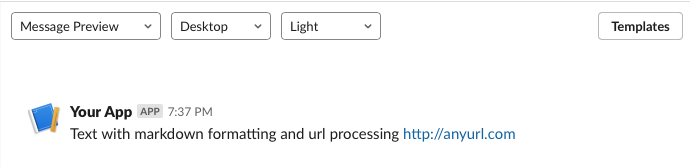
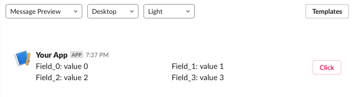
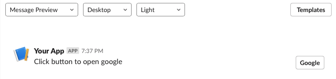
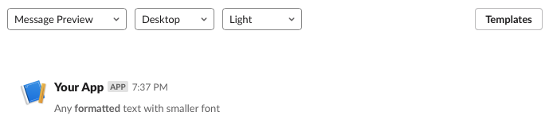
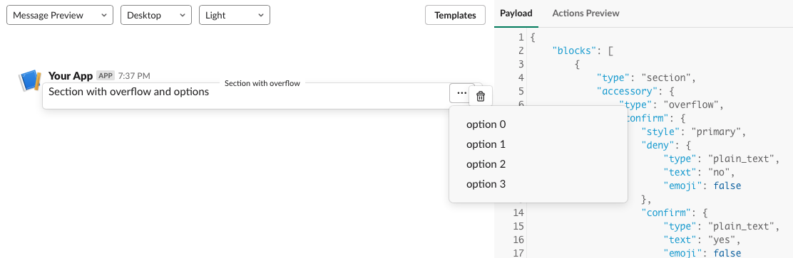
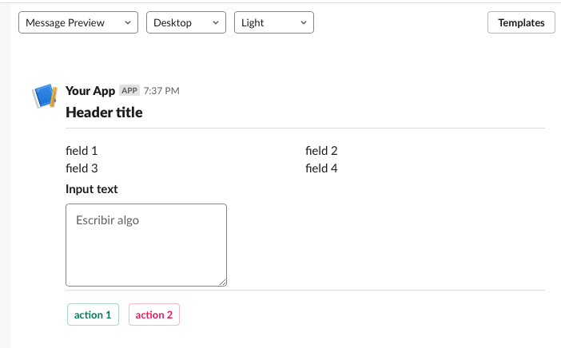

# Slack View Library

[Examples section](#examples)

Objects:

[AbstractBlock](#abstractblock), [AbstractBuilder](#abstractbuilder), [AbstractText](#abstracttext), [PlainText](#plaintext), [MarkDown](#markdown), [Divider](#divider), [Header](#header), [Image](#image), [Confirmation](#confirmation), [Button](#button), [Option](#option), [OptionGroup](#optiongroup), [SelectMenu](#selectmenu), [MultiSelectMenu](#multiselectmenu), [Overflow](#overflow), [PlainTextInput](#plaintextinput), [Section](#section)
[PlainTextInput](#plaintextinput), [Actions](#actions), [Context](#context), [Input](#input), [View](#view), [Modal](#modal), [Home](#home), [BlocksArray](#blocksarray), [BlocksFactory](#blocksfactory)

[Pydoc](docs/slack_view.html)

## Introduction

If you're reading this, is because either you love Slack, or just need to work with its API somehow. Recently I had to 
start implementing a bot in Slack which content was more complex than usual. Then, I found that Slack API was quite 
easy to use but.... its views, those contents in json can be soooo huge and complex, that I realized I spent most of my 
time designing templates instead of coding the logic of the bot.
This is when I started to look around searching for some library that would allow me to code my views in Python easily, 
unfortunately, I didn't found any (hey, if it does exist, please let me know, I had no idea about it) so I decided to
write this one.
The lib, includes "almost" all Block types, I just left out those that I was not gonna use for sure, but once you see 
the source code you'll realize it can be extended to include those pretty easily.

There is another module with a basic model to handle  Slack commands and interactions, named *payloads*
 
## Syntaxis

There is a convention to distinguish between *required*, *optional* and *mutually exclusive* attributes:

 - *required attributes*: Required attributes are represented for those builder's methods that **do not** have underscores at all.
 
 - *optional attributes*: Optional attributes are represented for those builder's methods that **do** have **one** underscore at the end, for example: `text()`, `element()`, ...
 
 - *mutually exclusive attributes*: In those cases where only one out of two attributes can be set, are represented for those builder's methods that **do** have a **double underscored** at the end, for example: `field__()`, `text__()`, ...
 
 
## Library's elements

Most of descriptions in next elements, has been extracted from current Slack's documentation.

### **AbstractBlock**

Main class that represents an instance of a Block element in Slack. Any instance that represents a block will inherit from it.

Builder's methods:

  - `__eq__(self, other)`: Implementation to compare AbstractBlock instances
  
  - `serialize(self, as_json=False)`: Serialized current instance as a dictionary. If as_json is True, then a json dumps is done with serialized dictionary
  
  - `deserialize(cls, _dict, from_json=False)`: Creates an AbstractBlock instance from supplied dictionary. If from_json is True, then the dictionary is built first from json loads.

### **AbstractBuilder**

Abstract class that represents a builder of an AbstractBlock. Any builder in an AbstractBlock must inherit from it. It allows a "method-chain-navigation" of the Block using the Builder pattern, allowing to step back to uppper builder when all settings in current builder are done.

Builder's methods:

  - `build()`: Provides the instance managed by current builder
  
  - `up()`: Returns previous builder
  
### **AbstractText**

Represents any Text block in Slack, and contains common functionality to both implementations, PlainText and MarkDown. 

Builder's methods:

  - `text()`: method to set current content.

### **PlainText** 

Text without any formatting.

Builder's methods:

  - `emoji_(self, boolean)`: Indicates whether emojis in a text field should be escaped into the colon emoji format

### **MarkDown**

Text with special slack formatting

Builder's methods:

  - `verbatim_(self, boolean)`: When set to false (as is default) URLs will be auto-converted into links, conversation names will be link-ified, and certain mentions will be automatically parsed. Using a value of true will skip any preprocessing of this nature, although you can still include manual parsing strings.

### **Divider**

A block's divider. Adds a horizontal line that can be use to separate block's

### **Header**

It's a block with the largest font text, and can be used for example as title at the begging of messages

Builder's methods:

 - `text(self, txt)`: Header content
 - `block_id_(self, block_id)`: Block id as a string
        
### **Image**

It's used to add any remote image to a message.        

Builder's methods:

 - `image_url(self, image_url)`: The URL of the image to be displayed.
 - `alt_text(self, alt_text)`: The text to be used as a a plain-text summary of the image. This should not contain any markup.
        
### **Confirmation**

It defines a dialog that provides a confirmation step to any interactive element.

Builder's methods:

 - `title(self, title)`: Confirmation dialog title
 - `confirm(self, confirm)`: The content of the plain_text-only text object that defines the text of the button
    that confirms the action
 - `deny(self, deny)`: The text for the plain_text-only text object that defines the text of the button that cancels the  action.
 - `text(self, text, verbatim=False)`: A text object that defines the explanatory text that appears in the confirm dialog.    
 - `style_(self, style)`: Defines the color scheme applied to the confirm button. A value of "danger" will display the button with a red background on desktop, or red text on mobile. A value of "primary" will display the button with a green background on desktop, or blue text on mobile.
            
### **Button**

Creates an interative component, a button. It can be clicked to set a value, perform an action, or open an url.

Builder's methods:

 - `action_id(self, action_id)`: An identifier for this action. You can use this when you receive an interaction payload to identify the source of the action. It MUST BE unique among all other action_ids used elsewhere in the app.
        
 - `text(self, text)`: A string for the plain_text object that defines the button's text.

 - `url_(self, url)`: A URL to load in the user's browser when the button is clicked.

 - `value_(self, value)`: The value to send along with the interaction payload.

 - `style_(self, style)`: Decorates buttons with alternative visual color schemes, "primary" gives buttons a green outline and text, primary should only be used for one button within a set, "danger" gives buttons a red outline and text, and should be used when the action is destructive.

 - `Confirm_(self)`: Provides a Confirmation builder object to help creating an optional confirmation dialog after
            the button is clicked.
            
### **Option**

An object that represents a single selectable item in a select menu, multi-select menu, checkbox group,radio button group, or overflow menu.

Builder's methods:

 - `text(self, text)`: A text object that defines the text shown in the option on the menu. Overflow, select, and multi-select
            menus can only use plain_text objects, while radio buttons and checkboxes can use mrkdwn text objects.

 - `value(self, value)`: The string value that will be passed to your app when this option is chosen.

 - `description_(self, description)`: The text for the plain_text only text object that defines a line of descriptive text shown below the text field beside the radio button.

 - `url_(self, url)`: An URL to load in the user's browser when the option is clicked. The url attribute is only available
            in overflow menus.

### **OptionGroup** 

It's used to group options in a select menu or multi-select menu.

Builder's methods:

 - `label(self, label)`: The text for the plain_text only text object that defines the label shown above this group of options.
        
 - `Option(self)`: Provides an instance of Option's builder

### **SelectMenu**

A select menu, just as with a standard HTML _select_ tag, creates a drop down menu with a list of options for 
a user to choose. The select menu also includes type-ahead functionality, where a user can type a part or all of an option string to filter the list.
    
Instance's methods:

  - `set_default(self, text_option)`: Sets default value in the menu. It's possible to supply, or the text that represents the underlying value in the menu, or the  value itself

  - `get_default(self)`: Provides the default option, if any, as a tuple

  - `has_option(self, text_option)`: Checks if the text supplied is already included in the array of options
    
Builder's methods:

  - `action_id(self, action_id)`: An identifier for the action triggered when a menu option is selected.

  - `placeholder(self, placeholder)`: A text for the plain_text object that defines the placeholder text shown on the menu.
 
  - `Option__(self)`: Provides an instance of Option's builder.
  
  - `OptionGroup__(self)`: Provides an instance of OptionGroup's builder.
                            
  - `initial_option_(self, text_option)`: A single option that exactly matches one of the options within options or option_groups.
            
  - `Confirm_(self)`: An instance of Confirmation's builder
            
### **MultiSelectMenu**

A multi-select menu is just like a Selectmenu, but allows a user to select multiple items from it.

Builder's methods, (others than Selectmenu):

  - `max_selected_items_(self, max_selected_items)`: Sets the maximum number of items that can be selected in the selectmenu.

### **Overflow**

This is like a cross between a button and a select menu - when a user clicks on this overflow button, they will be presented with a list of options to choose from. Unlike the select menu, there is no typeahead field, and the button always appears with an ellipsis ("...") rather than customisable text.

Builder's methods:

  - `action_id(self, action_id)`: An identifier for the action triggered when a menu option is selected.

  - `Option(self)`: An instance of Option's builder

  - `Confirm_(self)`: An instance of Confirm's builder           

### **PlainTextInput**

A plain-text input, it creates a field where a user can enter freeform data.

Builder's methods:

  - `action_id(self, action_id)`: An identifier for the input value when the parent modal is submitted.

  - `initial_value_(self, initial_value)`: The initial value in the plain-text input when it is loaded.

  - `min_length_(self, min_length)`: The minimum length of input that the user must provide.

  - `max_length_(self, max_length)`: The maximum length of input that the user can provide.

  - `multiline_(self, boolean)`: Indicates whether the input will be a single line (false) or a larger textarea (true). Default is false

  - `placeholder_(self, placeholder)`: A text to user in plain_text object that defines the placeholder text shown in the plain-text input.

### **Section**

A section can be used as a simple text block, in combination with text fields, or side-by-side with any of the available block elements.

Builder's methods:

  - `text__(self, text, verbatim=False)`: The text for the block, in the form of a text object.

  - `block_id_(self, block_id)`: A string acting as a unique identifier for a block.
  
  -  `field__(self, text, verbatim=False)`: Creates an a new MarkDown instance, and add it to the array of text objects.

  - `accessory_(self)`: Provides an inner class instance with a builder instance of each one of the available element objects. Namely: 
      - Button
      - Image
      - MultiSelectMenu
      - Overflow
      - PlainTextInput
      - SelectMenu

### **Actions**

This block is used to hold interactive elements.

Builder's methods:

  - `block_id_(self, block_id)`: A string acting as a unique identifier for this block.

  - `element(self)`: If no "elements" array is found, a new one is created, and an instance of an internal class with all builders from allowed elements is shown. The attribute "elements" holds an array of interactive element objects, namely:
  
    - Button
    - Overflow
    - SelectMenu

### **Context**

Displays message context, which can include both images and text. The size (images, fonts etc) of this block is smaller than other Blocks.

Builder's methods:

  - `block_id_(self, block_id)`: A string acting as a unique identifier for this block.

  - `element(self)`: If no "elements" array is found, a new one is created, and an instance of an internal class with all builders from allowed elements is shown. The attribute "elements" holds an array of interactive element objects, namely:

    - Image
    - Text
    
### **Input**

A block that collects information from users.

Builder's methods:

  - `label(self, label)`: A label that appears above an input element in the form of a text object as plain_text.

  - `element(self)`: If no "elements" array is found, a new one is created, and an instance of an internal class with all builders from allowed elements is shown. The attribute "elements" holds an array of interactive element objects, namely:

    - PlainTextInput
    - SelectMenu
    - MultiSelectMenu
    
### **View**

Abstract class that represents a View. There're two types of  views, namely Modals and Hometabs.

Builder's methods:

  - `title(self, txt)`: View title

  - `Blocks(self)`: Use this to build the array of blocks of the view

  - `close_(self, close_txt)`: An optional text to create a plain_text element that  defines the text displayed in the close button at the bottom-right of the view.
                
  - `submit_(self, submit_txt)`: Text to create an optional plain_text element that defines the text displayed in the submit button at the bottom-right of the view.
        
  - `private_metadata_(self, private_metadata)`: An optional string that will be sent to your app in view_submission and block_actions events.

  - `callback_id_(self, callback_id)`: An identifier to recognize interactions and submissions of this particular view.
  
  - `clear_on_close_(self, clear_on_close)`: When set to true, clicking on the close button will clear all views in a modal and close it. Defaults to false.

  - `notify_on_close_(self, notify_on_close)`: Indicates whether Slack will send your request URL a view_closed event when a user clicks the close button. Defaults to false.

  - `external_id_(self, external_id)`: A custom identifier that must be unique for all views on a per-team basis.

### **Modal**

A view which __type__ is "modal"

### **Home**

A view which __type__ is "home"

### **BlocksArray**

This object represents the array of blocks being sent in a Slack message. It doesn't extend AbstractBlocks because actually it's not a block, but a group of blocks in an array. So it just acts as a wrapper of an array with a dictionary of blocks

Instance's methods:

  - `serialize(self, as_json=False)`: Returns the array of blocks's dictionary. It's an array,  not a dictionary with key "blocks". The array is ready to be serialized in Slack, If as_json is True, then a jdon dumps is done with dictionary
       
  - `has_input_block(self)`: True if an Input exists in the array of blocks, False otherwise
  
  - `num_of_blocks(self)`: Provides the number of blocks in the array, it's length

  - `of(_array_of_dicts, from_json=False)`: Provides an instance of BlocksArray initialized with supplied array of serialized blocks. Supplied argument must be an array of Block's dictionaries, or a json dumps of such array, in this case from_json must be True.
  
  
Builder's methods:

Provide an instance of layou's builders previously seen. Namely:

  - Actions
  - Context
  - Divider
  - Header           
  - Input
  - Section

### **BlocksFactory**

Factory class to deserialize AbstractBlock back to objects. Source object can be a dictionary or a json dump of such dict.

Class's methods:

  - `get_block_class(cls, dictionary)`: Provides the class associated to supplied dictionary 
  
  - `of(dictionary, from_json=False)`: Builds an instance of a class that inherits from AbstractBlock from supplied dictionary. If supplied dictionary is a json dump, then from_json must be True
  
## Examples

Most of these examples can be tested in [Slack Block Kit Builder](https://app.slack.com/block-kit-builder).
Just clear the supplied default blocks and make sure to serialize supplied examples as json, for example:

`plaintext = PlainText.Builder().text('Simple text without formatting').build()`

  _{'type': 'plain_text', 'text': 'Simple text without formatting', 'emoji': False}_

then 

`plaintext = PlainText.Builder().text('Simple text without formatting').build().serialize(as_json=True)`

  _'{"type": "plain_text", "text": "Simple text without formatting", "emoji": false}'_
  
and copy the content between quotes (without the quotes) to *blocks* array. 
Sometimes, not all combinations are available in SBKB, but can be tested sending a message to a known private channel.

**Simple plaintext elements**

```
plaintext = PlainText.Builder().text('Simple text without formatting').build()
planintext_escaped = PlainText.Builder().text('Simple text with emojis escaped into colon emoji format :)') \
    .emoji_(True).build().serialize(as_json=True)
```

Json Serialized:

  _'{"type": "plain_text", "text": "Simple text without formatting", "emoji": false}'_
  
  _'{"type": "plain_text", "text": "Simple text with emojis escaped into colon emoji format :)", "emoji": true}'_

**Section with markdown**
```
section = Section.Builder().text__('Text with *markdown* _formatting_ and url processing http://anyurl.com').build().serialize(as_json=True)
```

Json Serialized:

  _'{"type": "section", "text": {"type": "mrkdwn", "text": "Text with *markdown* _formatting_ and url processing http://anyurl.com", "verbatim": false}}'_

Block Kit Builder image:

  

**Section with markdown and verbatim mode**

```
section_verbatim = Section.Builder().text__('Text in verbatim mode. For example urls are not processed: http://anyurl.com', verbatim=True).build().serialize(as_json=True)
```

Json Serialized:

  _'{"type": "section", "text": {"type": "mrkdwn", "text": "Text in verbatim mode. For example urls are not processed: http://anyurl.com", "verbatim": true}}'_

Block Kit Builder image:

  
  
**Section with 4 fields an a Button with confirmation**

```
section_with_fields = Section.Builder().block_id_('any block id')
for i in range(4):
    section_with_fields.field__(f'*Field_{i}*: value {i}')
section_with_fields.accessory_().Button().text('Click').action_id('action_name').style_('danger') \
    .Confirm_().title('Confirmation').style_('danger').text('are you sure?').confirm('yes').deny('no').up().up() \
    .build().serialize(as_json=True)
```

Json Serialized:

  _'{"type": "section", "accessory": {"type": "button", "confirm": {"style": "danger", "deny": {"type": "plain_text", "text": "no", "emoji": false}, "confirm": {"type": "plain_text", "text": "yes", "emoji": false}, "text": {"type": "mrkdwn", "text": "are you sure?", "verbatim": false}, "title": {"type": "plain_text", "text": "Confirmation", "emoji": false}}, "style": "danger", "action_id": "action_name", "text": {"type": "plain_text", "text": "Click", "emoji": false}}, "fields": [{"type": "mrkdwn", "text": "*Field_0*: value 0", "verbatim": false}, {"type": "mrkdwn", "text": "*Field_1*: value 1", "verbatim": false}, {"type": "mrkdwn", "text": "*Field_2*: value 2", "verbatim": false}, {"type": "mrkdwn", "text": "*Field_3*: value 3", "verbatim": false}], "block_id": "any block id"}'_

Block Kit Builder image:

  
  
**Section with text an a button that opens an url**

```
section_with_button = Section.Builder().text__('Click button to open google').accessory_() \
    .Button().action_id('any_action_name').text('Google').url_('http://www.google.com').up() \
    .build().serialize(as_json=True)
```

Json Serialized:

  _'{"type": "section", "accessory": {"type": "button", "url": "http://www.google.com", "action_id": "any_action_name", "text": {"type": "plain_text", "text": "Google", "emoji": false}}, "text": {"type": "mrkdwn", "text": "Click button to open google", "verbatim": false}}'_

Block Kit Builder image:

  
  
**Section with a multiline PlainInputText**

``` 
Section.Builder().text__('Please, input necessary content').accessory_() \
    .PlainTextInput().action_id('any_action_id').multiline_(True).initial_value_('Initial content').up() \
    .build().serialize(as_json=True)
```

Json Serialized:

  _'{"type": "section", "accessory": {"type": "plain_text_input", "multiline": true, "initial_value": "Initial content", "action_id": "any_action_id"}, "text": {"type": "mrkdwn", "text": "Please, input necessary content", "verbatim": false}}'_

Block Kit Builder image:

[Blocks builder does not allow me to show this in Blocks Kit Bilder]

**Context with mardown text**

```
context_with_text = Context.Builder().element().Text().text('Any *formatted* text with smaller font').up().build().serialize(as_json=True)
```

Json Serialized:

  _'{"type": "context", "elements": [{"type": "mrkdwn", "text": "Any *formatted* text with smaller font", "verbatim": false}]}'_

Block Kit Builder image:

  
 
**Overflow with options. As can be seen, since the reference of the builder is returned it's much easier to build
any content**

```
_builder_section = Section.Builder().text__('Section with overflow and options')
_builder_overflow = _builder_section.accessory_().Overflow()
_builder_overflow.action_id('any_action_id')
for i in range(4):
    _builder_overflow.Option().text(f'option {i}').value(f'{i}')
_builder_overflow.Confirm_().text('Confirmation option').title('are you sure?').confirm('yes').deny('no') \
    .style_('primary')
section_with_overflow = _builder_section.build().serialize(as_json=True)
```

Json Serialized:

  _'{"type": "section", "accessory": {"type": "overflow", "confirm": {"style": "primary", "deny": {"type": "plain_text", "text": "no", "emoji": false}, "confirm": {"type": "plain_text", "text": "yes", "emoji": false}, "text": {"type": "mrkdwn", "text": "Confirmation option", "verbatim": false}, "title": {"type": "plain_text", "text": "are you sure?", "emoji": false}}, "options": [{"value": "0", "text": {"type": "plain_text", "text": "option 0", "emoji": false}}, {"value": "1", "text": {"type": "plain_text", "text": "option 1", "emoji": false}}, {"value": "2", "text": {"type": "plain_text", "text": "option 2", "emoji": false}}, {"value": "3", "text": {"type": "plain_text", "text": "option 3", "emoji": false}}], "action_id": "any_action_id"}, "text": {"type": "mrkdwn", "text": "Section with overflow and options", "verbatim": false}}'_

Block Kit Builder image:

 

**BlocksArray with a Header, divider, Section with fields, Input with plaintextinput multiline and actions 
with a couple of buttons, one green (primary style) an another one red (danger style)**

```
blocks_array = BlocksArray.Builder() \
    .Header().text('Header title').up() \
    .Divider().up() \
    .Section().field__('field 1').field__('field 2').field__('field 3').field__('field 4').up() \
    .Input().label('Input text').element().PlainTextInput().multiline_(True).action_id('input_action_id').up().up() \
    .Divider().up() \
    .Actions().element().Button().action_id('action_1').text('action 1').style_('primary').up() \
              .element().Button().action_id('action_2').text('action 2').style_('danger').up() \
    .up().build().serialize(as_json=True)
```

Json Serialized:

  _'[{"type": "header", "text": {"type": "plain_text", "text": "Header title", "emoji": false}}, {"type": "divider"}, {"type": "section", "fields": [{"type": "mrkdwn", "text": "field 1", "verbatim": false}, {"type": "mrkdwn", "text": "field 2", "verbatim": false}, {"type": "mrkdwn", "text": "field 3", "verbatim": false}, {"type": "mrkdwn", "text": "field 4", "verbatim": false}]}, {"type": "input", "element": {"type": "plain_text_input", "multiline": true, "action_id": "input_action_id"}, "label": {"type": "plain_text", "text": "Input text", "emoji": false}}, {"type": "divider"}, {"type": "actions", "elements": [{"type": "button", "style": "primary", "action_id": "action_1", "text": {"type": "plain_text", "text": "action 1", "emoji": false}}, {"type": "button", "style": "danger", "action_id": "action_2", "text": {"type": "plain_text", "text": "action 2", "emoji": false}}]}]'_

Block Kit Builder image:

 
   
